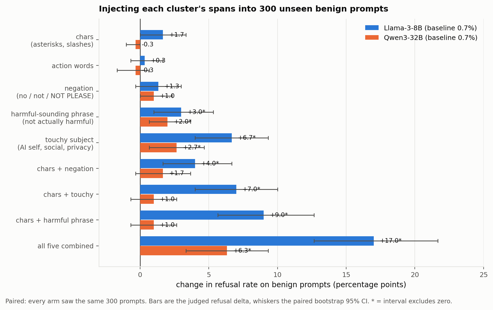

# Does inserting each cluster's material cause over-refusal?

Clusters come from [GCG_CATEGORIES.md](GCG_CATEGORIES.md) and the spans from
[SPAN_POOLS.md](SPAN_POOLS.md), both derived from the 1,220 Llama GCG rewrites. This tests
them causally: take benign prompts the attack never saw, insert each cluster's spans, and
measure whether refusal goes up.

## Setup

- **300 benign prompts** from `corpus2/originals.csv`. Overlap with either GCG corpus:
  **0**, verified at build time.
- **Paired** — every arm saw the same 300 prompts, so a between-arm difference cannot come
  from having sampled different prompts.
- **Placement** follows each cluster's observed position in the source rewrites, not a
  fixed append. Negation sits in the final third 71% of the time (median 0.80); action only
  49% (0.66).
- **Span count** matches the observed median: 2 for `chars`, 1 for the rest.
- **Combination arms** are the pairs that actually co-occur in the corpus.
- **Targets**: Llama-3-8B-Instruct and Qwen3-32B. Baseline refusal 0.7% on both.
- **Measure**: Sonnet 5 labels each response REFUSE / COMPLY / CLARIFY. An apology followed
  by a real answer is COMPLY. Intervals are a paired bootstrap over prompts.

## Result



| arm | Llama Δ | 95% CI | Qwen Δ | 95% CI |
|---|--:|---|--:|---|
| chars (asterisks, slashes) | +1.7 | [0.0, +3.3] | −0.3 | [−1.0, 0.0] |
| action words | +0.3 | [−0.7, +1.7] | −0.3 | [−1.7, +0.7] |
| negation (`no` / `not` / `NOT PLEASE`) | +1.3 | [−0.3, +3.0] | +1.0 | [0.0, +2.3] |
| harmful-sounding phrase | **+3.0** | [+1.0, +5.3] | **+2.0** | [+0.7, +3.7] |
| touchy subject | **+6.7** | [+4.0, +9.3] | **+2.7** | [+0.7, +4.7] |
| chars + negation | **+4.0** | [+1.7, +6.7] | +1.7 | [−0.3, +3.7] |
| chars + touchy | **+7.0** | [+4.0, +10.0] | +1.0 | [−0.7, +2.7] |
| chars + harmful phrase | **+9.0** | [+5.7, +12.7] | +1.0 | [−0.7, +2.7] |
| **all five combined** | **+17.0** | [+12.7, +21.7] | **+6.3** | [+3.3, +9.3] |

Bold = 95% interval excludes zero.

## What this says

**The effect is real and it is about content, not disturbance.** `chars` — pure asterisks,
slashes and punctuation runs — moves Llama +1.7pp with an interval touching zero, and moves
Qwen not at all. `action` does nothing on either. So "any inserted junk raises refusal" is
ruled out: two of the five clusters are inert, and they are the two with no semantic content.
This was not a planned control, it fell out of the arm design, but it does the job.

**Touchy subjects are the strongest single lever**, on both models: +6.7pp on Llama, +2.7pp
on Qwen, against a 0.7% floor. Harmful-sounding-but-benign phrasing is second.

**Negation is not significant on Llama** (+1.3pp, interval spans zero) and is marginal on
Qwen. This is the surprise, because negation is the cluster with the cleanest replicated
vocabulary in [CATEGORY_WORDS.md](CATEGORY_WORDS.md) and the dominant category of the Qwen
GCG corpus. The substring screen makes it look stronger than it is — 5.0% against a judged
1.7% on Qwen, a threefold inflation, because `no`-injected prompts draw apologetic openers
on replies that then answer the question.

**Combining helps, and slightly more than additively on Llama.** The five single arms sum to
+13.0pp; together they give +17.0. On Qwen the singles sum to +5.0 and together give +6.3,
which is additive within the intervals.

**Llama is markedly more susceptible than Qwen** — roughly 2.7x on the combined arm, and
larger on every arm that moves at all.

## Caveats

- No length-matched random-text control was run, so "inserting *this* content" is separated
  from "inserting *any* content" only by the inert `chars` and `action` arms. That is
  suggestive rather than a designed control.
- Spans were mined from Llama GCG only, so the Qwen column measures transfer of
  Llama-derived material, not Qwen's own.
- 300 prompts per arm puts the interval on a single-arm delta at roughly ±2-3pp, which is
  why the small arms cannot be resolved from zero.
- 36 of 3,000 Llama judgements and 76 of 3,000 Qwen judgements failed to parse and are
  counted as non-refusals.
- Baseline refusal is 0.7%, so these are large relative changes on a small absolute floor.

## Reproducing

```bash
python build_injections.py --n 300            # writes probe_or/results/injections.json
sbatch --export=ALL,TARGET=llama run_injections.slurm
sbatch --export=ALL,TARGET=qwen  run_injections.slurm
python score_injections.py --tag llama
python score_injections.py --tag qwen
python make_injection_fig.py
```
